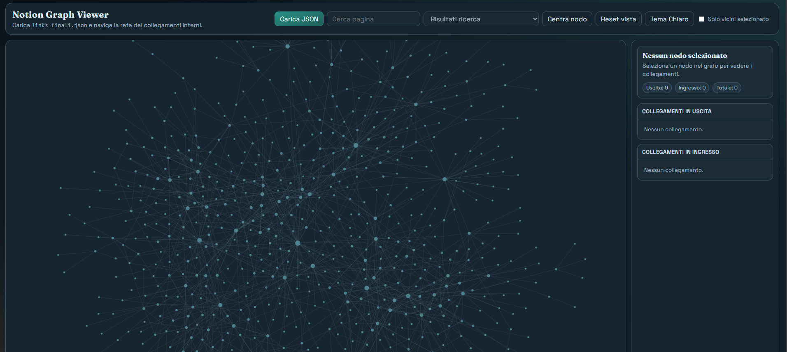

# Notion2Graph 🌐

Dear stats lovers 💚, I built something completely useless, but my brain demanded it for too long.

I wanted a navigable graph (Obsidian-style) using a Notion backup.

Steps:
* Download your backup from the Notion home page by selecting “Export” with these settings: *Markdown, include subpages, create folder for subpages*
* Run the script scan the folders with *python notion_graph.py BackupDirectoryPath/* and it will generate the file *notion_links.json* containing all page-to-page relationships.
* Open the HTML page and load the JSON file created in the previous step.

**Privacy guarantee**: the script recursively scans for page links only (it ignores the content) and then generates a JSON output to load into the UI.

A few notes:
- It doesn’t handle external links (in my case they were irrelevant).
- It doesn’t handle database pages (same reason).
- YES, it was written with help of Codex.

Result: a real map of chaos, with a few useful insights for cleaning up and reorganizing.

I’ve got 132 nodes and 230 edges. Let me know your metrics too 👻

